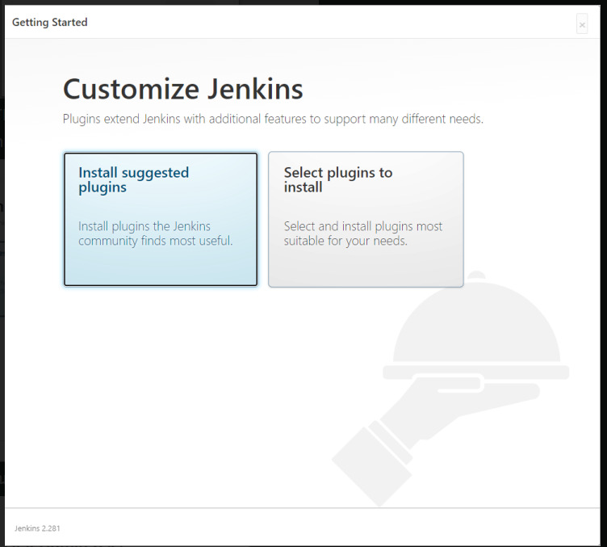
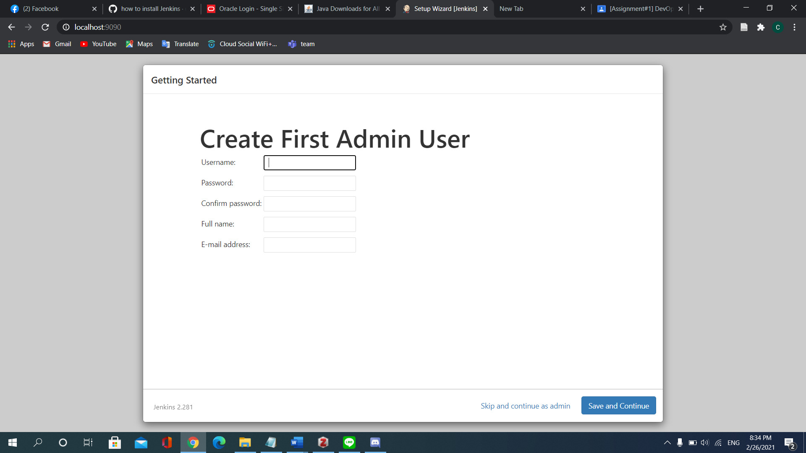
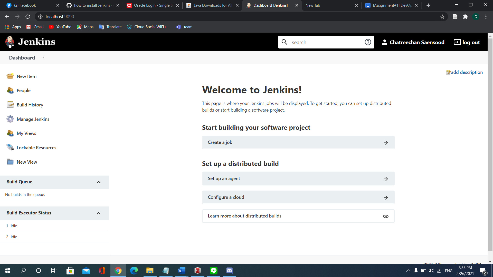
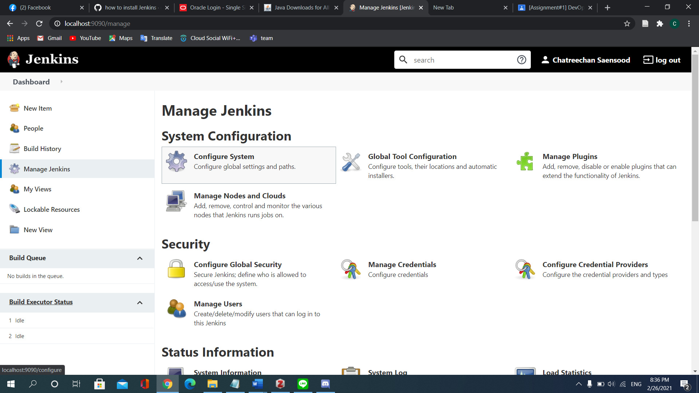
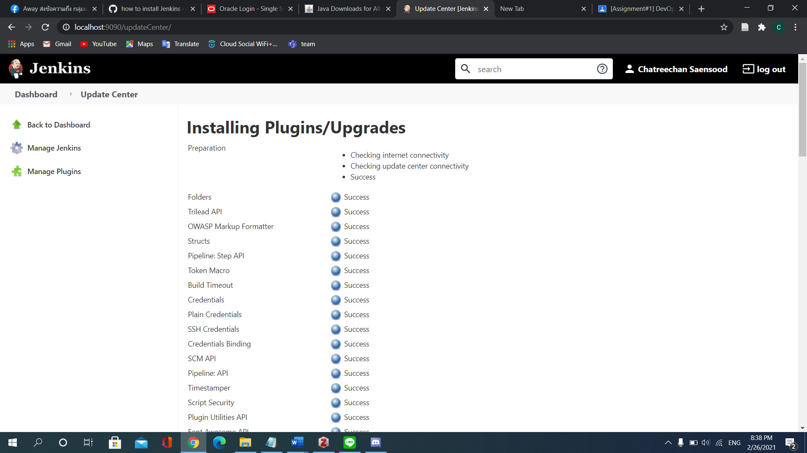
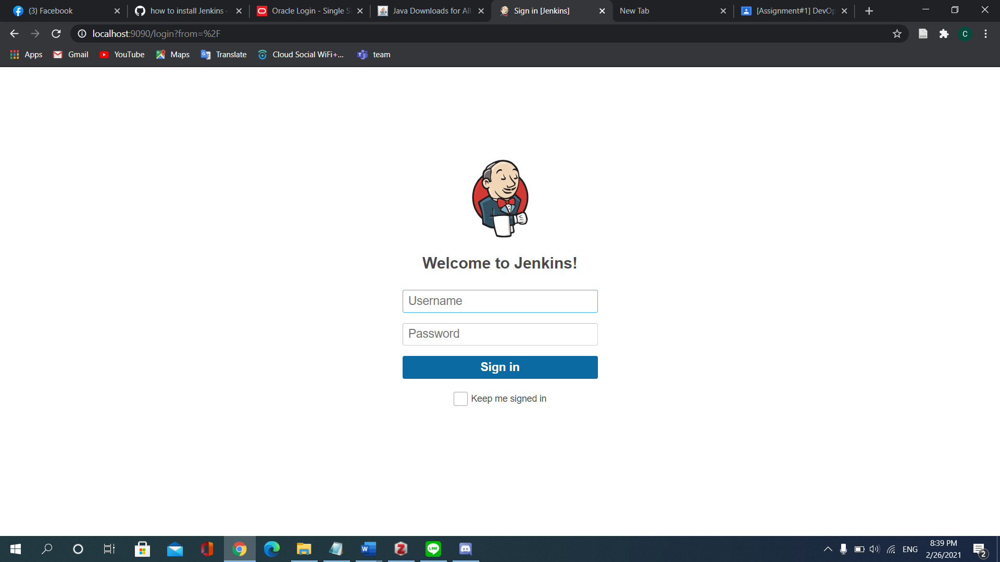

## ขั้นตอนการติดตั้ง **Jenkins**

ทำการดาวน์โหลดและติดตั้ง **Jenkins** จาก https://www.jenkins.io/download/
โดยเลือก **Download Jenkins version for : Windows** (ในกรณีที่ใช้ระบบปฏิบัติการ Windows)
	

	
(ในที่นี้ใช้ version 2.281)

	> หากในเครื่องไม่มี JRE ต้องทำการติดตั้ง JRE ก่อน โดยสามารถดูได้จาก cmd และพิมพ์ java
	> โดยสามารถดาวน์โหลดได้จาก https://www.oracle.com/java/technologies/javase-jre8-downloads.html
	

	
เมื่อติดตั้งเสร็จแล้วให้กด Finish จากนั้นจะมีหน้าเว็บขึ้นมา ให้ทำการสมัคร

เมื่อกรอก Password แล้วจะให้สร้าง User Admin ให้ทำการ Create User เมื่อเสร็จแล้วกด __Save__ __and__ __Continue__

-หน้าเว็บ Jenkins

-เมื่อทำการสร้าง Account สำเร็จจะ redirectไปยังหน้า Dashboard กดเลือก Manage Jenkins >> Manage Plugins จากนั้นค้นหา Robot Framework plugin แล้วกดติดตั้ง

-เมื่อติดตั้งสำเร็จจะรี Jenkins และ ให้ล็อกอินอีกครั้ง 

เสร็จเรียบร้อย

